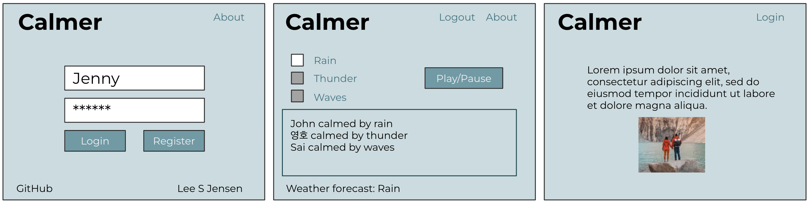
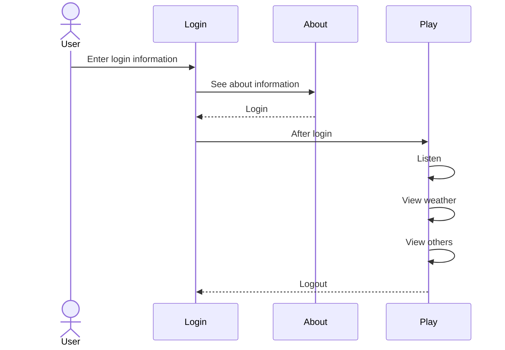

# Calmer

[My Notes](notes.md)

Calmer plays calming background noise that puts you into a state of blissful peace.

## 🚀 Specification Deliverable

For this deliverable I did the following. I checked the box `[x]` and added a description for things I completed.

- [x] Proper use of Markdown
- [x] A concise and compelling elevator pitch
- [x] Description of key features
- [x] Description of how you will use each technology
- [x] One or more rough sketches of your application. Images must be embedded in this file using Markdown image references.

### Elevator pitch

In a world filled with loud, distracting, anxiety inducing voices, what we need is something to slow us down and get our minds into a stream of focused mindfulness. Open `Calmer`, select your favorite tones, and feel the peace. You can save your preferred calming environment, and also see who is calming down.

### Design

Three different views provide login, playing, and about information. The play view allows the user to pick their calming tones, see what other users are playing, and also get the current weather forecast.

### Key features

- Login, logout, and register
- Select calming tones to play
- See what others are calming with
- See the current weather
- See a description of the app

### Technologies

I am going to use the required technologies in the following ways.

- **HTML** - Three different views, login/register controls, image, calming tone selection.
- **CSS** - Complementary color scheme, responsive design, image animation.
- **React** - Single page application with routing between views, reactive user controls, and state hooks.
- **Service** - Endpoints for authentication, storing/retrieving calming preference. Third party call to get weather forecast.
- **DB/Login** - Stores authentication and calming preferences.
- **WebSocket** - Broadcast user's calming.

## 🚀 AWS deliverable

For this deliverable I did the following. I checked the box `[x]` and added a description for things I completed.

- [x] **Server deployed and accessible with custom domain name** - [My server link](https://byucsstudent.click).

## 🚀 HTML deliverable

For this deliverable I did the following. I checked the box `[x]` and added a description for things I completed.

- [x] **HTML pages** - Three different pages. One for each view.
- [x] **Proper HTML element usage** - I spent a lot of time learning about elements. I used header, footer, main, nav, img, a, fieldset, input, button, form, and many more.
- [x] **Links** - Links between views.
- [x] **Text** - About page has text.
- [x] **3rd party API placeholder** - Play page has a place to display the current weather.
- [x] **Images** - Application logo is displayed on the about page.
- [x] **Login placeholder** - Placeholder for auth on the login page.
- [x] **DB data placeholder** - Play will load and display their selected tones from the database.
- [x] **WebSocket placeholder** - The play pages has a text area that will show what other users are being calmed by.

## 🚀 CSS deliverable

For this deliverable I did the following. I checked the box `[x]` and added a description for things I completed.

- [x] **Header, footer, and main content body** - I used a common CSS file to style these.
- [x] **Navigation elements** - Bootstrap NavBar. What a time saver.
- [x] **Responsive to window resizing** - Bootstrap and `display:flex' did most the work here.
- [x] **Application elements** - I used a lot of `display:flex` to get things to align correctly.
- [x] **Application text content** - Set all my text to Helvetica and it looks nice and clean.
- [x] **Application images** - Use an SVG that changes color on hover. I left the about image as is.

## 🚀 React part 1: Routing deliverable

For this deliverable I did the following. I checked the box `[x]` and added a description for things I completed.

- [x] **Bundled using Vite** - Easy to install and use Vite.
- [x] **Components** - Easy to bring the code over from HTML and CSS, but had to rework them quite a bit.
- [x] **Router** - Easy to creating the component routing.

## 🚀 React part 2: Reactivity

For this deliverable I did the following. I checked the box `[x]` and added a description for things I completed.

- [x] **All functionality implemented or mocked out** - All of the service mocking is abstracted to the `service.js` file.
- [x] **Hooks** - So many hooks. useState and useEffect in every component.

## 🚀 Service deliverable

For this deliverable I did the following. I checked the box `[x]` and added a description for things I completed.

- [ ] **Node.js/Express HTTP service** - I did not complete this part of the deliverable.
- [ ] **Static middleware for frontend** - I did not complete this part of the deliverable.
- [ ] **Calls to third party endpoints** - I did not complete this part of the deliverable.
- [ ] **Backend service endpoints** - I did not complete this part of the deliverable.
- [ ] **Frontend calls service endpoints** - I did not complete this part of the deliverable.

## 🚀 DB/Login deliverable

For this deliverable I did the following. I checked the box `[x]` and added a description for things I completed.

- [ ] **User registration** - I did not complete this part of the deliverable.
- [ ] **User login and logout** - I did not complete this part of the deliverable.
- [ ] **Stores data in MongoDB** - I did not complete this part of the deliverable.
- [ ] **Stores credentials in MongoDB** - I did not complete this part of the deliverable.
- [ ] **Restricts functionality based on authentication** - I did not complete this part of the deliverable.

## 🚀 WebSocket deliverable

For this deliverable I did the following. I checked the box `[x]` and added a description for things I completed.

- [ ] **Backend listens for WebSocket connection** - I did not complete this part of the deliverable.
- [ ] **Frontend makes WebSocket connection** - I did not complete this part of the deliverable.
- [ ] **Data sent over WebSocket connection** - I did not complete this part of the deliverable.
- [ ] **WebSocket data displayed** - I did not complete this part of the deliverable.
- [ ] **Application is fully functional** - I did not complete this part of the deliverable.
